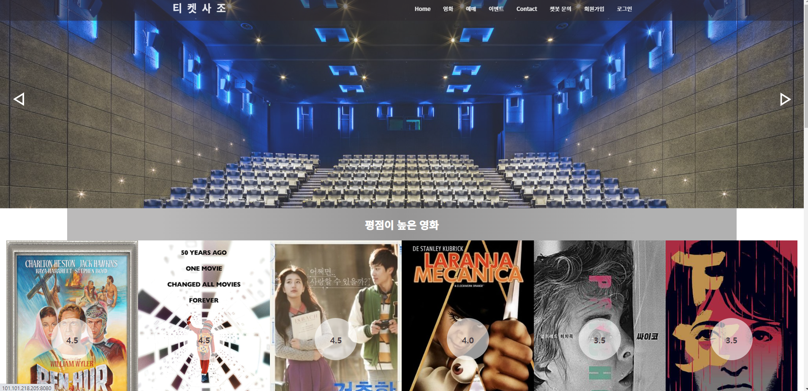
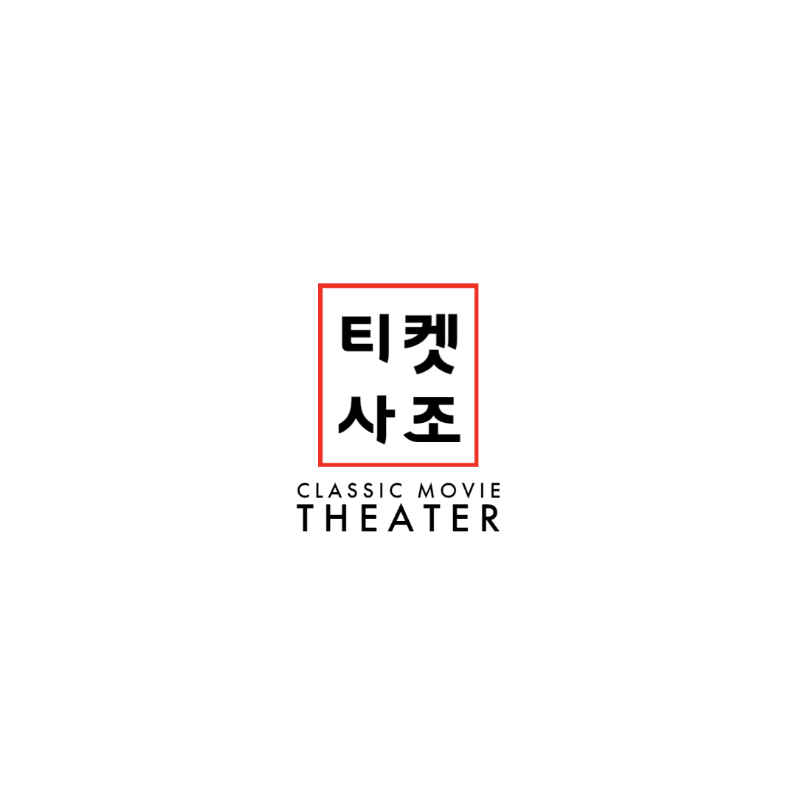
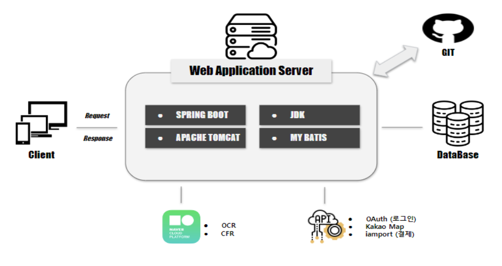
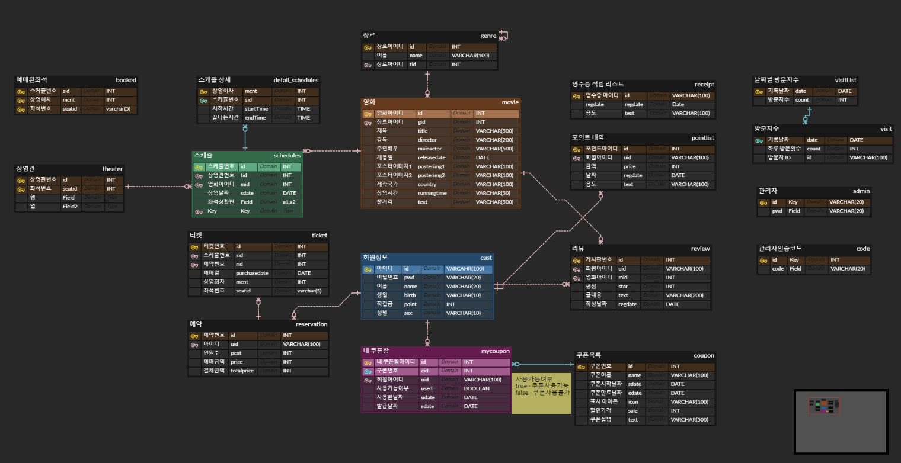
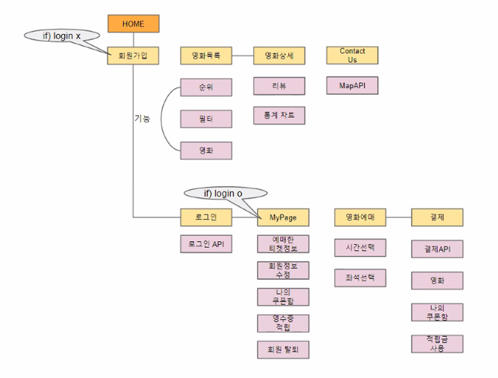

\# 티켓사조

팀명: 티켓 사조  

팀장: 김민식

팀원: 안원영, 장효준, 정세연

## 프로젝트 정보

### 1. 프로젝트 주제
Spring boot를 활용한 클래식 영화관 티켓팅 서비스 및 NCP AI 플랫폼을 활용한 고객편의기능 구현

### 2. 프로젝트 목적

1. 클라우드 환경 사용
2. 자리 예매 기능 구현
3. AI Platform(CLOVA OCR)을 활용한 영수증사지을 이용한 적립금 기능 구현
4. AI Platform(CLOVA CFR)을 활용한 닮은 꼴 배우 찾기 이벤트 페이지 구현
5. 네이버, 구글, 페이스북 등 다양한 로그인 API를 활용한 로그인 기능 구현

### 3. 프로젝트 기능 구현
1. 영화 좌석 선택 및 예약
2. AI를 활용한 영수증 인식 후 포인트 적립, 적립 내역 조회 기능
3. 로그인 API(OAuth) 사용해 로그인 및 회원가입 기능
4. 결제 API 기능 
5. 영화 필터 검색 기능
6. 성별, 나이 정보를 바탕으로 통계표 기능
7. 리뷰, 평점 기능
8. CLOVA Face Recognition(CFR)을 이용한 닮은 꼴 배루 찾지 이벤트 페이지 구현

### 4. 프로젝트 역할 분담 
| 이름 | 역할 |
|---------|--------|
| 김민식 |영화 상세 페이지(통계차트), 영화리스트 페이지, CHATBOT, Contact Us 페이지(구글맵, 문의사항 메일로 전송), CLOVA Face Recognition (CFR), Admin 페이지 (고객/영화/스케줄/쿠폰/포인트 관리, 예매내역 조회, 로그인, 회원가입)|
| 안원영 |로그인 API(**OAuth**), NCP AI CLOVA OCR* (쿠폰 or 적립), 리뷰 순위 페이지, 포인트 적립, 메인 페이지(서치 기능), Admin 페이지(메인 페이지에 차트), &nbsp; 쿠폰|
| 장효준 | 예매(좌석선택, 극장선택, 시간선택) , 결제 API, Admin 페이지(스케줄 관리)|
| 정세연 |회원가입, 일반 로그인, MyPage(나의 예매내역, 내 포인트 내역 조회, 내 쿠폰 내역 조회, 회원탈퇴, 회원정보변경, 비밀번호 변경)|

### 5. 프로젝트 개발 환경 및 수행 도구

언어 | 웹 | 개발도구 | DataBase | 협업도구 | FrameWork
---- | ---- | ---- | ---- | ---- | ---- |
JAVA, SQL | HTML5,&nbsp; CSS3, JS, jQuery, Ajax, Bootstrap | Eclipse, NCP | Mysql | Zoom, Google Docs, Github, ERD Cloud,Padlet, Notion | Spring Boot, Mybatis

### 6. 데이터베이스 설계
ERD: [티켓사조](https://www.erdcloud.com/d/Gb6vzq6LdsJjFpduL)

### 7. UI 설계

## 프로젝트 결과

### Ticket SaJo 관리자 사이트

## 개인 Project 구상 * 기획 * 개발

[22.06.29 Fianl-Project 브레인 스토밍 ](%E1%84%8F%E1%85%B3%E1%86%AF%E1%84%85%E1%85%A2%E1%84%89%E1%85%B5%E1%86%A8%20%E1%84%8B%E1%85%A7%E1%86%BC%E1%84%92%E1%85%AA%E1%84%80%E1%85%AA%E1%86%AB%20%E1%84%90%E1%85%B5%E1%84%8F%E1%85%A6%E1%86%BA%E1%84%90%E1%85%B5%E1%86%BC%20%E1%84%89%E1%85%A5%E1%84%87%E1%85%B5%E1%84%89%E1%85%B3%20(%E1%84%8C%E1%85%B5%E1%86%AB%E1%84%92%E1%85%A2%E1%86%BC%E1%84%8C%E1%85%AE%E1%86%BC)%205312ea98a9ef47848084dbadc15f798a/22%2006%2029%20Fianl-Project%20%E1%84%87%E1%85%B3%E1%84%85%E1%85%A6%E1%84%8B%E1%85%B5%E1%86%AB%20%E1%84%89%E1%85%B3%E1%84%90%E1%85%A9%E1%84%86%E1%85%B5%E1%86%BC%20b98452bc0af74afd835fa6bf8d34e5e2.md)

[22.06.30 Fianl-Project 브레인 스토밍 ](%E1%84%8F%E1%85%B3%E1%86%AF%E1%84%85%E1%85%A2%E1%84%89%E1%85%B5%E1%86%A8%20%E1%84%8B%E1%85%A7%E1%86%BC%E1%84%92%E1%85%AA%E1%84%80%E1%85%AA%E1%86%AB%20%E1%84%90%E1%85%B5%E1%84%8F%E1%85%A6%E1%86%BA%E1%84%90%E1%85%B5%E1%86%BC%20%E1%84%89%E1%85%A5%E1%84%87%E1%85%B5%E1%84%89%E1%85%B3%20(%E1%84%8C%E1%85%B5%E1%86%AB%E1%84%92%E1%85%A2%E1%86%BC%E1%84%8C%E1%85%AE%E1%86%BC)%205312ea98a9ef47848084dbadc15f798a/22%2006%2030%20Fianl-Project%20%E1%84%87%E1%85%B3%E1%84%85%E1%85%A6%E1%84%8B%E1%85%B5%E1%86%AB%20%E1%84%89%E1%85%B3%E1%84%90%E1%85%A9%E1%84%86%E1%85%B5%E1%86%BC%20abc6e7955a5544a988e48eec545c32cf.md)

[22.07.01 Fianl-Project 브레인 스토밍 ](%E1%84%8F%E1%85%B3%E1%86%AF%E1%84%85%E1%85%A2%E1%84%89%E1%85%B5%E1%86%A8%20%E1%84%8B%E1%85%A7%E1%86%BC%E1%84%92%E1%85%AA%E1%84%80%E1%85%AA%E1%86%AB%20%E1%84%90%E1%85%B5%E1%84%8F%E1%85%A6%E1%86%BA%E1%84%90%E1%85%B5%E1%86%BC%20%E1%84%89%E1%85%A5%E1%84%87%E1%85%B5%E1%84%89%E1%85%B3%20(%E1%84%8C%E1%85%B5%E1%86%AB%E1%84%92%E1%85%A2%E1%86%BC%E1%84%8C%E1%85%AE%E1%86%BC)%205312ea98a9ef47848084dbadc15f798a/22%2007%2001%20Fianl-Project%20%E1%84%87%E1%85%B3%E1%84%85%E1%85%A6%E1%84%8B%E1%85%B5%E1%86%AB%20%E1%84%89%E1%85%B3%E1%84%90%E1%85%A9%E1%84%86%E1%85%B5%E1%86%BC%207a72bf721ef54315927b774b57edf40d.md)

[22.07.02 Fianl-Project 브레인 스토밍 ](%E1%84%8F%E1%85%B3%E1%86%AF%E1%84%85%E1%85%A2%E1%84%89%E1%85%B5%E1%86%A8%20%E1%84%8B%E1%85%A7%E1%86%BC%E1%84%92%E1%85%AA%E1%84%80%E1%85%AA%E1%86%AB%20%E1%84%90%E1%85%B5%E1%84%8F%E1%85%A6%E1%86%BA%E1%84%90%E1%85%B5%E1%86%BC%20%E1%84%89%E1%85%A5%E1%84%87%E1%85%B5%E1%84%89%E1%85%B3%20(%E1%84%8C%E1%85%B5%E1%86%AB%E1%84%92%E1%85%A2%E1%86%BC%E1%84%8C%E1%85%AE%E1%86%BC)%205312ea98a9ef47848084dbadc15f798a/22%2007%2002%20Fianl-Project%20%E1%84%87%E1%85%B3%E1%84%85%E1%85%A6%E1%84%8B%E1%85%B5%E1%86%AB%20%E1%84%89%E1%85%B3%E1%84%90%E1%85%A9%E1%84%86%E1%85%B5%E1%86%BC%200c36e71b783747a1a8bdf2560d8f8e99.md)

[22.07.05 Fianl-Project 기획 ](%E1%84%8F%E1%85%B3%E1%86%AF%E1%84%85%E1%85%A2%E1%84%89%E1%85%B5%E1%86%A8%20%E1%84%8B%E1%85%A7%E1%86%BC%E1%84%92%E1%85%AA%E1%84%80%E1%85%AA%E1%86%AB%20%E1%84%90%E1%85%B5%E1%84%8F%E1%85%A6%E1%86%BA%E1%84%90%E1%85%B5%E1%86%BC%20%E1%84%89%E1%85%A5%E1%84%87%E1%85%B5%E1%84%89%E1%85%B3%20(%E1%84%8C%E1%85%B5%E1%86%AB%E1%84%92%E1%85%A2%E1%86%BC%E1%84%8C%E1%85%AE%E1%86%BC)%205312ea98a9ef47848084dbadc15f798a/22%2007%2005%20Fianl-Project%20%E1%84%80%E1%85%B5%E1%84%92%E1%85%AC%E1%86%A8%2016258b58906b4fbab9e6dd1b5769fd5c.md)

[22.07.06 Fianl-Project 기획 ](%E1%84%8F%E1%85%B3%E1%86%AF%E1%84%85%E1%85%A2%E1%84%89%E1%85%B5%E1%86%A8%20%E1%84%8B%E1%85%A7%E1%86%BC%E1%84%92%E1%85%AA%E1%84%80%E1%85%AA%E1%86%AB%20%E1%84%90%E1%85%B5%E1%84%8F%E1%85%A6%E1%86%BA%E1%84%90%E1%85%B5%E1%86%BC%20%E1%84%89%E1%85%A5%E1%84%87%E1%85%B5%E1%84%89%E1%85%B3%20(%E1%84%8C%E1%85%B5%E1%86%AB%E1%84%92%E1%85%A2%E1%86%BC%E1%84%8C%E1%85%AE%E1%86%BC)%205312ea98a9ef47848084dbadc15f798a/22%2007%2006%20Fianl-Project%20%E1%84%80%E1%85%B5%E1%84%92%E1%85%AC%E1%86%A8%20f5e617d0db9444f39747c6d54013155e.md)

[22.07.07 Fianl-Project 기획 ](%E1%84%8F%E1%85%B3%E1%86%AF%E1%84%85%E1%85%A2%E1%84%89%E1%85%B5%E1%86%A8%20%E1%84%8B%E1%85%A7%E1%86%BC%E1%84%92%E1%85%AA%E1%84%80%E1%85%AA%E1%86%AB%20%E1%84%90%E1%85%B5%E1%84%8F%E1%85%A6%E1%86%BA%E1%84%90%E1%85%B5%E1%86%BC%20%E1%84%89%E1%85%A5%E1%84%87%E1%85%B5%E1%84%89%E1%85%B3%20(%E1%84%8C%E1%85%B5%E1%86%AB%E1%84%92%E1%85%A2%E1%86%BC%E1%84%8C%E1%85%AE%E1%86%BC)%205312ea98a9ef47848084dbadc15f798a/22%2007%2007%20Fianl-Project%20%E1%84%80%E1%85%B5%E1%84%92%E1%85%AC%E1%86%A8%202a657f69b6604e1795677485595659ad.md)

[22.07.11 Fianl-Project 개발](%E1%84%8F%E1%85%B3%E1%86%AF%E1%84%85%E1%85%A2%E1%84%89%E1%85%B5%E1%86%A8%20%E1%84%8B%E1%85%A7%E1%86%BC%E1%84%92%E1%85%AA%E1%84%80%E1%85%AA%E1%86%AB%20%E1%84%90%E1%85%B5%E1%84%8F%E1%85%A6%E1%86%BA%E1%84%90%E1%85%B5%E1%86%BC%20%E1%84%89%E1%85%A5%E1%84%87%E1%85%B5%E1%84%89%E1%85%B3%20(%E1%84%8C%E1%85%B5%E1%86%AB%E1%84%92%E1%85%A2%E1%86%BC%E1%84%8C%E1%85%AE%E1%86%BC)%205312ea98a9ef47848084dbadc15f798a/22%2007%2011%20Fianl-Project%20%E1%84%80%E1%85%A2%E1%84%87%E1%85%A1%E1%86%AF%209a45a15ac2ad4e65a93faf32d55df557.md)

[22.07.12 Fianl-Project 개발](%E1%84%8F%E1%85%B3%E1%86%AF%E1%84%85%E1%85%A2%E1%84%89%E1%85%B5%E1%86%A8%20%E1%84%8B%E1%85%A7%E1%86%BC%E1%84%92%E1%85%AA%E1%84%80%E1%85%AA%E1%86%AB%20%E1%84%90%E1%85%B5%E1%84%8F%E1%85%A6%E1%86%BA%E1%84%90%E1%85%B5%E1%86%BC%20%E1%84%89%E1%85%A5%E1%84%87%E1%85%B5%E1%84%89%E1%85%B3%20(%E1%84%8C%E1%85%B5%E1%86%AB%E1%84%92%E1%85%A2%E1%86%BC%E1%84%8C%E1%85%AE%E1%86%BC)%205312ea98a9ef47848084dbadc15f798a/22%2007%2012%20Fianl-Project%20%E1%84%80%E1%85%A2%E1%84%87%E1%85%A1%E1%86%AF%209f5837db2d22435094580f64be59ba83.md)

[22.07.13 Fianl-Project 개발](%E1%84%8F%E1%85%B3%E1%86%AF%E1%84%85%E1%85%A2%E1%84%89%E1%85%B5%E1%86%A8%20%E1%84%8B%E1%85%A7%E1%86%BC%E1%84%92%E1%85%AA%E1%84%80%E1%85%AA%E1%86%AB%20%E1%84%90%E1%85%B5%E1%84%8F%E1%85%A6%E1%86%BA%E1%84%90%E1%85%B5%E1%86%BC%20%E1%84%89%E1%85%A5%E1%84%87%E1%85%B5%E1%84%89%E1%85%B3%20(%E1%84%8C%E1%85%B5%E1%86%AB%E1%84%92%E1%85%A2%E1%86%BC%E1%84%8C%E1%85%AE%E1%86%BC)%205312ea98a9ef47848084dbadc15f798a/22%2007%2013%20Fianl-Project%20%E1%84%80%E1%85%A2%E1%84%87%E1%85%A1%E1%86%AF%20973adbae0f6f481b9c72ce5abb97ad20.md)

[22.07.14~26 Fianl-Project 개인 개발](%E1%84%8F%E1%85%B3%E1%86%AF%E1%84%85%E1%85%A2%E1%84%89%E1%85%B5%E1%86%A8%20%E1%84%8B%E1%85%A7%E1%86%BC%E1%84%92%E1%85%AA%E1%84%80%E1%85%AA%E1%86%AB%20%E1%84%90%E1%85%B5%E1%84%8F%E1%85%A6%E1%86%BA%E1%84%90%E1%85%B5%E1%86%BC%20%E1%84%89%E1%85%A5%E1%84%87%E1%85%B5%E1%84%89%E1%85%B3%20(%E1%84%8C%E1%85%B5%E1%86%AB%E1%84%92%E1%85%A2%E1%86%BC%E1%84%8C%E1%85%AE%E1%86%BC)%205312ea98a9ef47848084dbadc15f798a/22%2007%2014~26%20Fianl-Project%20%E1%84%80%E1%85%A2%E1%84%8B%E1%85%B5%E1%86%AB%20%E1%84%80%E1%85%A2%E1%84%87%E1%85%A1%E1%86%AF%20fc97fd6b8bee4f74a0c5e9bcb8f00a47.md)

[22.07.27 Fianl-Project 중간 발표](%E1%84%8F%E1%85%B3%E1%86%AF%E1%84%85%E1%85%A2%E1%84%89%E1%85%B5%E1%86%A8%20%E1%84%8B%E1%85%A7%E1%86%BC%E1%84%92%E1%85%AA%E1%84%80%E1%85%AA%E1%86%AB%20%E1%84%90%E1%85%B5%E1%84%8F%E1%85%A6%E1%86%BA%E1%84%90%E1%85%B5%E1%86%BC%20%E1%84%89%E1%85%A5%E1%84%87%E1%85%B5%E1%84%89%E1%85%B3%20(%E1%84%8C%E1%85%B5%E1%86%AB%E1%84%92%E1%85%A2%E1%86%BC%E1%84%8C%E1%85%AE%E1%86%BC)%205312ea98a9ef47848084dbadc15f798a/22%2007%2027%20Fianl-Project%20%E1%84%8C%E1%85%AE%E1%86%BC%E1%84%80%E1%85%A1%E1%86%AB%20%E1%84%87%E1%85%A1%E1%86%AF%E1%84%91%E1%85%AD%204474808c18b2492b8dd8c7447b3ec536.md)

[22.07.27~ Fianl-Project 개인 개발](%E1%84%8F%E1%85%B3%E1%86%AF%E1%84%85%E1%85%A2%E1%84%89%E1%85%B5%E1%86%A8%20%E1%84%8B%E1%85%A7%E1%86%BC%E1%84%92%E1%85%AA%E1%84%80%E1%85%AA%E1%86%AB%20%E1%84%90%E1%85%B5%E1%84%8F%E1%85%A6%E1%86%BA%E1%84%90%E1%85%B5%E1%86%BC%20%E1%84%89%E1%85%A5%E1%84%87%E1%85%B5%E1%84%89%E1%85%B3%20(%E1%84%8C%E1%85%B5%E1%86%AB%E1%84%92%E1%85%A2%E1%86%BC%E1%84%8C%E1%85%AE%E1%86%BC)%205312ea98a9ef47848084dbadc15f798a/22%2007%2027~%20Fianl-Project%20%E1%84%80%E1%85%A2%E1%84%8B%E1%85%B5%E1%86%AB%20%E1%84%80%E1%85%A2%E1%84%87%E1%85%A1%E1%86%AF%2068d360fd2857453a86db09389ee39914.md)

## 프로젝트 관련 자료

- 제안 요청서 (RFP)
  
    [RFP1.0.hwp](%E1%84%8F%E1%85%B3%E1%86%AF%E1%84%85%E1%85%A2%E1%84%89%E1%85%B5%E1%86%A8%20%E1%84%8B%E1%85%A7%E1%86%BC%E1%84%92%E1%85%AA%E1%84%80%E1%85%AA%E1%86%AB%20%E1%84%90%E1%85%B5%E1%84%8F%E1%85%A6%E1%86%BA%E1%84%90%E1%85%B5%E1%86%BC%20%E1%84%89%E1%85%A5%E1%84%87%E1%85%B5%E1%84%89%E1%85%B3%20(%E1%84%8C%E1%85%B5%E1%86%AB%E1%84%92%E1%85%A2%E1%86%BC%E1%84%8C%E1%85%AE%E1%86%BC)%205312ea98a9ef47848084dbadc15f798a/RFP1.0.hwp)
    
- 요구사항 정의서

[요구사항.xlsx](https://docs.google.com/spreadsheets/d/1zxziyQmYhLGoes65Drm3nR-ITSRQ8t1O/edit?usp=drive_web&ouid=105051611234612731581&rtpof=true)

- ERD

[티켓사줘](https://www.erdcloud.com/d/Gb6vzq6LdsJjFpduL)

- UI설계

[https://docs.google.com/presentation/d/176k--5z45jnKjw7wpXgmnHfMEYfp_1rr/edit#slide=id.p1](https://docs.google.com/presentation/d/176k--5z45jnKjw7wpXgmnHfMEYfp_1rr/edit#slide=id.p1)

[Ticket_SaJo DML.sql](%E1%84%8F%E1%85%B3%E1%86%AF%E1%84%85%E1%85%A2%E1%84%89%E1%85%B5%E1%86%A8%20%E1%84%8B%E1%85%A7%E1%86%BC%E1%84%92%E1%85%AA%E1%84%80%E1%85%AA%E1%86%AB%20%E1%84%90%E1%85%B5%E1%84%8F%E1%85%A6%E1%86%BA%E1%84%90%E1%85%B5%E1%86%BC%20%E1%84%89%E1%85%A5%E1%84%87%E1%85%B5%E1%84%89%E1%85%B3%20(%E1%84%8C%E1%85%B5%E1%86%AB%E1%84%92%E1%85%A2%E1%86%BC%E1%84%8C%E1%85%AE%E1%86%BC)%205312ea98a9ef47848084dbadc15f798a/Ticket_SaJo_DML.sql)

[Ticket_SaJo DDL.sql](%E1%84%8F%E1%85%B3%E1%86%AF%E1%84%85%E1%85%A2%E1%84%89%E1%85%B5%E1%86%A8%20%E1%84%8B%E1%85%A7%E1%86%BC%E1%84%92%E1%85%AA%E1%84%80%E1%85%AA%E1%86%AB%20%E1%84%90%E1%85%B5%E1%84%8F%E1%85%A6%E1%86%BA%E1%84%90%E1%85%B5%E1%86%BC%20%E1%84%89%E1%85%A5%E1%84%87%E1%85%B5%E1%84%89%E1%85%B3%20(%E1%84%8C%E1%85%B5%E1%86%AB%E1%84%92%E1%85%A2%E1%86%BC%E1%84%8C%E1%85%AE%E1%86%BC)%205312ea98a9ef47848084dbadc15f798a/Ticket_SaJo_DDL.sql)